# Terms
* Micro receiver, micro RX.
* Receiver, Regular receiver, main receiver, main RX.
* Transmitter, TX.
* IR trigger : trigger system built in to the device, uses IR sensor.
* EXT trigger : trigger system using the M-LVDS connection.

# Typical configurations
Receiver and transmitter.

Receiver + sensor with two transmitters.

Receiver (IR off) + two sensors and two transmitters.


# IR element
The currently used IR detector model is TSSP 4056. It was chosen as the fastest Vishay IR sensors I could find, but has a drawback of beeing very susceptible to noise caused by DC light (sunlight in my case). It came as a surprise to me, that DC light pose such a big problem for this receiver whose carier frequency is 56kHz. 

## Intense IR light from a LED
Here are presented some examples of mentioned noise. No 56kHz carrier was present at tthat time, only noise (DC light) sources in close proximity to the sensor. Case removed, sensor exposed.

Zoomed out view:

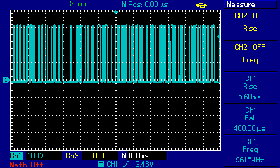

A closeup. High current through the IR emmiting diode:

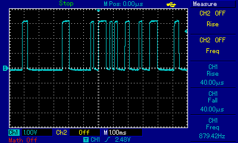

A closeup. Low current through the IR emmiting diode:

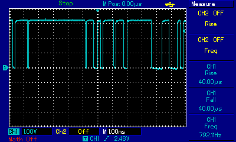

Thanks to the logic analyzer we can learn about certain properties of tyhe noise:

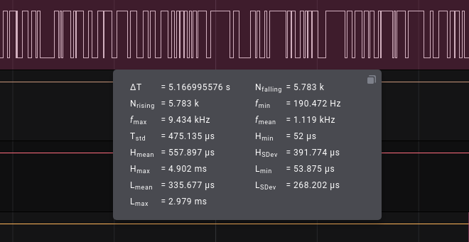

Consistently with my earlier observations, the shortest noise spike is 52-54µs.

## 100W incandescent lightbulb
The noise is very simmilar (to the naked eye) as the previous one, with an exception of sporadically ocurring very short pulses of 125-250ns. There were periods as long as 4s without such a spike in that plot. Sensor exposed.

Plot itself (6ms per division):

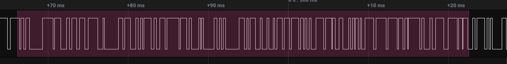

Statistics:

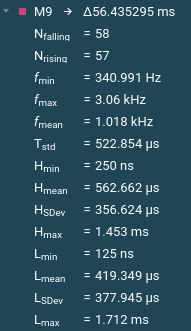

## Sun
The sun is my main concern since the devices will be operated outdoors. September (I don't remember if the case was removed or not):

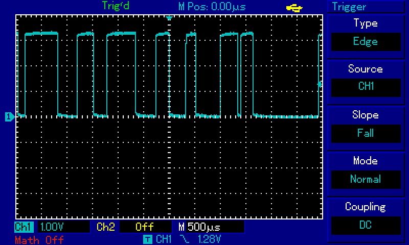

## A trigger event
### Clean
Clean trigger event (12ms) looks like that (see below). The plot depicted below was generated using a trasmitter located very close to the receiver, but it's strength was set to bare minimum. The same clean plots can be observed with TX and RX placed much more apart from each other. No DC noise other than ambient light from the window (day, shadows):

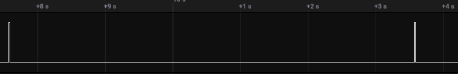

A closeup (whole 12ms):

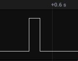

### Noise
2 12ms noisy trigger events 6s apart. Transmitter and the noise source (an IR led) were very close to the IR sensitive element. Noise IR diode emmited DC light:


A closeup of the above example (12ms):


### Severe noise
Very noisy signal. This time the TX was moved away, and the current through the IR LED was set to the minimum. Additionally, the whole transmitter was misaligned. Trigger events (still 6s apart, 12ms in length) are marked with redish color. The receiver was working fine, but the accuracy deteriorated (i'd say to a little better than 1ms):

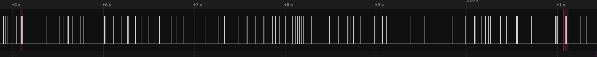

A closeup of the above:

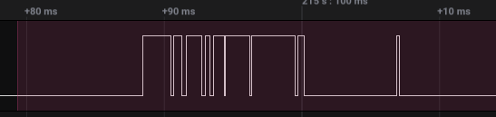

## Response time


# Trigger
## Trigger and noise mitigation algorithm
`IrTriggerDetector.cc` contains the trigger algorithm. Instead of sampling the IR sensor signal in small intervals, it uses EXTI IRQ. Note that there are only 3 different EXTI ISR (interrupt service routines) available on the `stm32f072`, and all three are used by different peripherals: the IR trigger, the EXT trigger, and the button. 

The main complexity arises from the fact, that I do not sample the IR signal continuously (like a DSP woudl do), but to minimze memory usage, I react to the IR signal changes in an ISR (`onEdge`). The drawback of this approach is that I'm equally interested both in IR signal changes as well as in how long the signal **did not change**. And as such I had to implement another function which periodiacally does just that : it checks how long the IR signal was steady. This second method is named `run`. This approach makes the code much more complex (or so I suspect, because I haven't implement it differently) because the algorithm is split into two tightly coupled methods which depend on time, input events and each other.

Detecting a clean IR trigger event is the simplest case. Such an event looks like this (minTriggerEvent is set to 10ms. This can be changed using an USB command):

```
      ________
_____|        |________.______
        10ms+   10ms+
     a        b        c
```     

* `onEdge` ISR detects *a*, and stores it in the 3 element queue. 
* Then 2 things may happen:
  * `run` detects that *a* occured more than 10ms ago (and there were no other edges in this period). It sets the `pwmState` to `PwmStata::high` and `highStateStart` to queue[2] (most recent).
  * `onEdge` ISR detects *b*, and stores it in the 3 element queue (a corner case where b occurs **exactly** 10ms after b - not likely to happen). `pwmState` is changed to `PwmState::high`, and the `highStateStart` is set to the queue second element's timestamp (secod is the one element before the current one).
* `run` which is called periodically (as fast as possible) detects the *c*. *c* is not an event but rather an observation, that the event *b* was detected more that 10ms ago.

Noise mitigation is implemented using a 3 element circullar queue (dubed queue later on) and an PWM checking algoritm. Everytime the new edge is stored in the last `queue` element, the first is discarded, and the PWM of such a slice is calculated. Then if the duty cycle is higher than a certain treshold (more than 25%) then the internal state (`pwmState` later on) is changed to `PwmState::high` and the timestamp of the oldest rising edge (queue element 0 or 1) is stored in the `highStateStart` variable. 
If the PWM duty cycle of the slice is lower than the certain treshold (different than the previous one, and currently set to 12,5%), then the simmilar things happen, namely the `pwmState` is flipped to `PwmState::low`, and the timestamp is stored in the `lowStateStart`.
At the end the `checkForEventCondition` is invoked. It compares `highStateStart`, `lowStateStart` and the last edge's timestamp to see if they qualify as the correct trigger event. The high state had to be present for 10ms or more, then the low had to be present for next 10ms or more (10ms as an example). 

This way we can detect a trigger event even if the levels were interrupted by (short) noise spikes of opposite polarisation than the level.

Reasons why the queue is only 3 elements long:
* `onEdge` can be called very frequently (a few µs succession), so the computations there should be very fast as well. The more elements, the more time spent on the calculations.
* If number of elements was 5 or more, a moderately noisy signal like depicted below would be hard to analyze, because it consists of only 4 edges:

```
      ___   ___
_____|   |_|   |________
```

Problems
* Many complex corner cases had to be implemented. This is rather caused by my implementation (likely) than the problem itself.
* The split to two methods depending on each other. Part of the data is collected ana alayzed in one method, and part in another. 

## Noise detection
`noiseCounter`

## Blind state
Is managed by the `BlindManager` class. Its `start` method starts the so called blind period when the (main) device does not react to any events. To remember:
* "Micro" sensors does not have this functionality built in. They always send a pulse on the LVDS.
* The main receiver has a global `BlindManager` which is controlled by:
  * `FastStateMachine` chekcs if "not blind" and starts the blind period upon receiveing `Event::Type::irTrigger` or `Event::Type::externalTrigger`.
  * `IrTriggerDetector` (formely known as the `EdgeDetector`) checks if not blind in both `onEdge` and run `methods` to prevent spurious state changes in the object. Without this safety check, there could have been false triggers reported to the `FastStateMachine` after the blind period expired.

The rationale behind this is to maintain a single global "blind timer" managed by the main device, meaning that every gate (i.e. light barier) is disabled during this period (technicaly it is not, but the main device does not react).

# CAN Bus
50kbps, only for communications. No time-related stuff.


Micro side (from startup)
| sends                               | receives          |
| ----------------------------------- | ----------------- |
| Message::CONFIG_REQUEST (from main) |                   |
|                                     | Message::INFO_REQ |
| Message::INFO_RESP (as a response)  |                   |
|                                     | Message::INFO_REQ |
| Message::INFO_RESP (as a response)  |                   |
