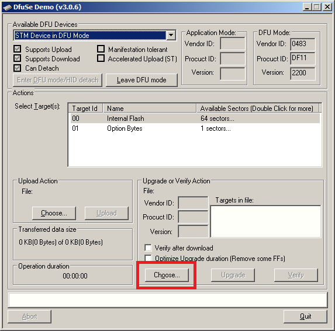

See [link link](http://) to see more.
Buy [on Tinidie](http://) TODO.

# Firmware upgrade
## Linux
Manjaro : install dfu-util and run it as so:

```sh
dfu-util -D receiver.dfu -a0
```

Notes to myself (irrelevant to the end-user):

```
dfu-util -D receiver.bin -d 0483:df11 -a0 --dfuse-address 0x08000000
git clone git@github.com:majbthrd/elf2dfuse.git
elf2dfuse receiver.elf receiver.dfu
```

## Windows
Install [ST's DFU program](https://www.st.com/en/development-tools/stsw-stm32080.html) (login required). Run the program. A window will pop up:


Connect the stopwatch, and the turn it on **holding the button pressed on**. The stopwatch should then be recognized and it shoud show up in the combo box as depicted below:



Pick a firmware file you want to use. The newest firmware can be always [found here](https://github.com/gp8-stopwatch/receiver-firmware/releases).


Simply click the "Upgrade" button:


Click "Yes" if the popup like shown below shows up:


# Key elements
```StopWatch``` class implements the time measurement. It uses TIM14 which runs at 100Hz, 1kHz or 10kHz depending on ```Config.resolution```. Its ```start``` method clears the ```TIM14->CNT``` (timer runs all the time), and sets a variable so that we know that tiome measurement is taking place. Upon ```stop``` call remaining value from ```TIM14->CNT``` is rounded and basing on this 1 is added to the ```time``` field.

```InfraRedBeamModulated```

```FastStateMachine```


# Features
* X ppm accuracy
* Screen brightness auto adjusts according to a ambient light sensor.

Maximum error between the devices should not exceed 2*20ppm (worst case).

# Challenges
* Accuracy

# Links
* Bob's take on moto-gymkhana stop watch : https://github.com/boons605/MotoGymkhanaRaceTiming
* Pyxis's tripod : https://www.thingiverse.com/thing:3284642

# Libraries, and 3rd party sources used:
* https://github.com/majbthrd/stm32cdcuart
* https://github.com/antirez/linenoise (?)
* STM32F0 cube
* etl
* GSL
  
# Serial connection 
## Linux
Use you favourite serial terminal:

``` sh
dterm /dev/ttyACM0 115200
```

## Windows
Windows versions prior to Windows 10 require a driver to be installed. You can find it in [this link](https://www.st.com/en/development-tools/stsw-stm32102.html). Unfortunately an email address is required in the process.


Install the driver:


Connect the gp8 stop watch, turn it on and observe if it is actually recognized by Windows. You can use Windows Device Manager for this:


Download and install [Putty](https://www.putty.org/) and open it. You will be presented with a configuration dialog where you need to set the "Serial" option using radio buttons depicted below. Set "Serial line" to the value observbed in the previous step and set "Speed" to 115200 baud. 


Click open, and a terminal window should appear:


Input "help" for available commands.