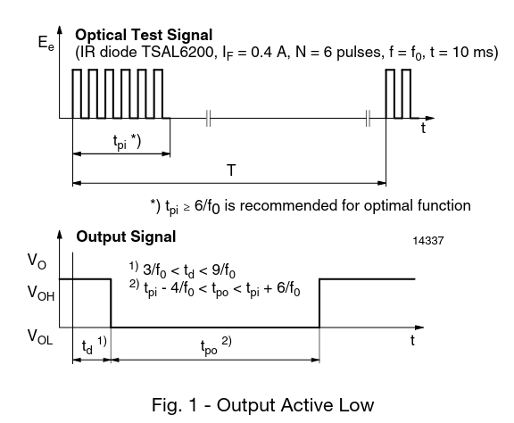
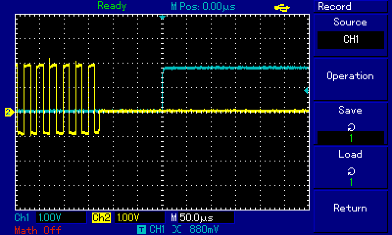

# The goal
My goals :

* [ ] Superb : sub 1ppm - no error between 2 stop-watches running for 99 minutes, 99 seconds and 99 100th of a second (tested against a reference source as well).
* [ ] Satisfactory : 2ppm ?
* [ ] Absolute required : no difference on two random stopwatches running say 2 minutes with 10ms resolution (this is about 80ppm).

The above goals are important to be able to show off the product. The simplest test is to test them against each other.

# Definitions
* Receiver test trigger : a physical test point on the receiver PCB that you can connect to and start/stop the timer without any transmitter.
* Transmitter test trigger : a physical test point on the transmitter PCB which lets one to simulate an object passing by through the IR beam. It has the same purpose as the receiver test trigger, but this time we take the IR part into account.

# Factors affecting accuracy of measured time in GP8 stopwatch.
## Oscillator *Relative test, Absolute test*
This problem is quite straightforward, use the most accurate and stable resonator / oscillator there is, while maintaining the cost on a viable level. I'm in the process of testing ~~2ppm~~ 0.5ppm TCXOs now.

# Program
## Trigger algorithm 
How the timers are configured and used (TIM14 for stopwatch and TIM1 for trigger) how interrupts are configured and serviced etc.

Refresh rate of the screen started to have impact. Probably some bug in the code.

## Trigger
## IR Receiver component
Receiver speed / time resolution - I'm referring to the IR receiver component. Most of the receivers are suited for receiving fast and short bursts of IR signals of the carrier wave frequency like 38kHz. This is because they are all designed for remote control applications like TVs. Sucha a receiver would not only include a band pass filter to allow only the carrier in, but also a signal conditioning circuit which would additionally filter out any spurious bursts (of incorrect length). In other words, bursts have to conform to specs. For example, the minimum length of a burst in case of Sharp GP1UX51QS receiver was 600µs, and the maximum 1200µs (this is for a high-level pulse, for low-level pulse figures are quite similar). That means, that shining a continuous carrier signal would not work (this is a scenario best suited for my need). And an excerpt from the datasheet of aforementioned component : *In case the signal format of total duty and/or ON/OFF signal time dosen`t meet the conditions noted above, there is a case that reception distance much reduces or output dose not appear.* (sic).

If a continuous signal is bad, then (I assume) one should use the fastest 50% duty cycle signal possible. I went for 1kHz initially which translates to 500µs high, and 500µs low pulses, so this way we can have a 500µs error.

Initially, I went for Vishay's TSOP 38338. It also have very precise requirements for the signal (bear with me, I'm talking about the final bursts of 38khZ carrier not, the carrier itself). For instance, on page 5 of the datasheet they state, that :
* For bursts greater than 35 cycles, a minimum gap time in the data stream is needed of > 6 x burst length. 
* The maximum number of continuous short bursts/second : 2000. 
So seems like we can't use a continuous signal (my tests showed otherwise, at least sort of), and the other way around, we cannot use bursts more frequent than 2kHz which is another way of increasing trigger accuracy. But the most crucial parameter is the response time:



According to the datasheet (fig 1 page 2), td is between 3/f0 and 9/f0, in other words we can expect a response (low level) from 79µs to 237µs after an IR diode started to transmit a burst, and I assume the same goes for when a diode stops the transmission (which is interesting for us). So the error here is about 150µs in the worst case (for one receiver. For two, the total error can be as bad as 300µs). My crude observations showed it to be even smaller (the lag was 150µs on average spanning from about 125µs to 175µs). Note : the lag itself is not a huge problem since a stopwatch is stopped and started **usually** using the same trigger, so those lags cancel each other out, but the problem is a latency variance between them.



[Application note](https://www.vishay.com/docs/82741/tssp4056sensor.pdf)
Next I performed some *rough* latency tests. Results:

| Lag (td) TSSP4056 µs | TSMP 58138  (6 pulses of 56kHz carrier)            | TSOP 38338                                                          |
| -------------------- | -------------------------------------------------- | ------------------------------------------------------------------- |
| 210                  | 110                                                |
| 130                  | 110                                                |
| 210                  | 110                                                |
| 210                  | 95                                                 |
| 210                  | 90                                                 |
| 200                  |                                                    |
| 210                  |                                                    |
| 130                  |                                                    |
| 140                  |                                                    |
| 140                  |                                                    |
| 140                  |                                                    |
| 210                  |                                                    |
| Measured : **80µs**  | **20µs** (theoretical not fouhn) but modulation is | measured **~40µs**, theoretical 160 @ 6cycles                       |
| Datasheet **142µs**  | required. 50% duty @ 56kHz is ~100µs,              | + modulation errors (~160) so in total IMHO 160+(160/2) = **240µs** |
|                      | so IMHO the total error is **90-110µs**            |

Latency depends on IR strength, so I


| Part                                   | Notes                                                                                                   |
| -------------------------------------- | ------------------------------------------------------------------------------------------------------- |
| TSMP58000                              | Minimal lag, small sensitivity (range 5m @ 400mA IR).                                                   |
| TSOP22xx, TSOP24xx, TSOP48xx, TSOP44xx | 7/f0 > td > 15/f0, range (range 45m @ 200mA IR)                                                         |
| TSOP312, TSOP314                       | 7/f0 > td > 15/f0, range (range 45m @ 200mA IR)                                                         |
| TSOP381xx, TSOP383xx, TSOP353xx        | 3/f0 > td > 9/f0, range (range 45m @ 200mA IR)                                                          |
| TSSP40xx                               | 7/f0 > td > 15/f0, range (range 25m @ 200mA IR) -                                                       |
| TSSP4056                               | specially for light barriers (38kHz & 56kHz), there are                                                 |
|                                        | no requirements for the pulses, so maybe better suited for                                              |
|                                        | continuous operation? Still 142µs lag dispersion @ 56kHz                                                |
|                                        | Application : Fast proximity sensors for toys, robotics, drones, and other consumer and industrial uses |
| TSOP21.., TSOP23.., TSOP41..,          | Simmilar to  TSOP38xxx                                                                                  |
| TSOP43.., TSOP25.., TSOP45.            |
| TSMP58138                              | For repeaters. There's no concreet figures, but from the                                                |
|                                        | picture I estimate the (constant part) of the lag to be  ~80µs.                                         |
|                                        | No error is given, so...                                                                                |
 
Vishay markings:
* O = for IR receiver applications
* M = for repeater/learning applications
* S = for sensor applications

Conclusions:
* Use what I use, but constant signal (test extensively). Understand the plots of this irradiance. It may be, that sensitivity drops when pulses are too long.
* UNDERSTAND IRRADIANCE PLOTS! These plots for TSOPs and TSSPs are distinct. It is as if TSOPs were less sensitive for long bursts where as TSSPs are unconcerned by the burst length. [Wikipedia says the irradiance](https://en.wikipedia.org/wiki/Irradiance) is also called an intensity.
* Maybe as above, but with 56kHz
* Test parts for light barriers.
* Test part for repeaters and IR code sniffers.

Links:
* https://electronics.stackexchange.com/questions/70811/ir-receivers-how-to-interpet-max-envelope-duty-cycle-vs-burst-length
* https://electronics.stackexchange.com/questions/70891/strange-and-contradictory-agc-characteristics-in-datasheet
* http://www.vishay.com/ir-receiver-modules/
* http://www.vishay.com/ir-receiver-modules/presence-sensor/
* https://www.researchgate.net/publication/300910559_IR_Barrier_Data_Integration_for_Obstacle_Detection
  
# Accuracy test cases
Changing test conditions / environment. Every test can / should be performed in these varying conditions:
* Various stopwatch accuracies. 10ms, 1ms, 100µs and 10µs.
* Various levels of IR intensity (as set on the transmitter).
* Presense of reflections.
* Artificial light (fluorescent, LED).
* Sunlight of varius intensities (direct sun / cloudy / night)
* Different temperatures. 0°C as well as in 50°C. Using the IR.

Tests to perform (in importance order):
A1. 1 receiver and 1 transmitter. Signal generator connected to the *transmitter test trigger*. Transmitter outputs an IR trigger every N seconds. 
 
Desired outcome : every result displayed on the receiver's screen is in spec.

```
                                +------------+ 
                                |            | 
                                | signal     | 
                                | generator  | 
                                |            | 
                                +------|-----+ 
                                       |       
                                       |       
                                       |       
+-------------+                +-------|------+
|             |                |              |
|  receiver   <-------IR-------- transmitter  |
|             |                |              |
+-------------+                +--------------+
```

A2. Like test 1. but with micro-reveiver connected to the main-receiver.

```
                                                              +------------+ 
                                                              |            | 
                                                              | signal     | 
                                                              | generator  | 
                                                              |            | 
                                                              +------|-----+ 
                                                                     |       
                                                                     |       
                                                                     |       
+-------------+                +-------------+               +-------|------+
|             |                |             |               |              |
|  receiver   -----CAN bus------  micro rx   <------IR-------- transmitter  |
|             |                |             |               |              |
+-------------+                +-------------+               +--------------+
```

A3. 2 receivers are connected using CAN bus, and one transmitter is connected to an external signal generator. Transmitter outputs a trigger signal to both receivers, but receivers are modified so they react to every second event. This way, by turinig them on in correct order one can simulate two transmitters using only one.

Scenario
* Transmitter (instructed by the signel generator) outputs a trigger event. Both receivers are able to detect it, but only the **receiver 1** processes it because of the *modulo 2* mechanism (elaborate). The **receiver 1** would be at the **START** of the circuit in normal circumstances.
* The **receiver 1** immediately sends a CAN bus signal to the **receiver 2** and starts counting, updating its screen as the time passes.
* **Receiver 2** triggered by the CAN signal received from the first receiver also starts counting. Receiver 2 would be located at the **END** of the course.
* Transmitter once again sends a trigger event. This time the *modulo 2* mechanism causes that only the **receiver 2** reacts to the event and immediately stops counting.
* The **receiver 2** sends the final result to the **receiver 1** which also stops its counter, discards its result, and displays the result of the **receiver 2**.

```
                                          +------------+ 
                                          |            | 
                                          | signal     | 
                                          | generator  | 
         +-------------+                  |            | 
         |             |                  +------|-----+ 
+---------  receiver 1 <\                        |       
|        |             | ---\                    |       
|        +-------------+     -IR\                |       
|             mod2               --\     +-------|------+
|                                   ---\ |              |
| CANbus                                -- transmitter  |
|                                    --/ |              |
|                                 --/    +--------------+
|                              IR/                       
|        +-------------+    --/                          
|        |             | --/                             
----------  receiver 2 </                                
         |             |                                 
         +-------------+                                 
              mod2                                       
```

A4. Variation of test 2 with two micro receivers.

```
                                                              +------------+ 
                                                              |            | 
                                                              | signal     | 
                                                              | generator  | 
                             +-------------+                  |            | 
                             |             |                  +------|-----+ 
                        +-----  micro rx   <\                        |       
                        |    |             | ---\                    |       
                        |    +-------------+     -IR\                |       
+-------------+         |         mod2               --\     +-------|------+
|             |         |                               ---\ |              |
|  receiver   --CAN bus--                                   -- transmitter  |
|             |         |                                --/ |              |
+-------------+         |                             --/    +--------------+
                        |                          IR/                       
                        |    +-------------+    --/                          
                        |    |             | --/                             
                        +-----  micro rx   </                                
                             |             |                                 
                             +-------------+                                 
                                  mod2                                       
```

A5. Two one or two receivers bypasing the IR sensor. This can be useful as the sensor has the biggest error of all the elements. This time an exetrnal signal generator is connected to the *receiver test trigger* GPIO of both receivers **OR** directly to IR output pin (test point P5). 

```
             +------------+             
             |            |             
             | signal     |             
             | generator  |             
             |            |             
             +------|-----+             
                    |                   
                    |                   
+-------------+     |    +-------------+
|             |     |    |             |
|  receiver   ------------  receiver   |
|             |          |             |
+-------------+          +-------------+
```

A6. So called *crude test*. Simply trigger two independent receivers and observe if results are the same. 

```
+-------------+                                        
|             |                                        
|  receiver   <--\                                     
|             |   -----\                               
+-------------+         -IR--\        +---------------+
                              -----\  |               |
                                    ---  transmitter  |
                              -----/  |               |
+-------------+         -IR--/        +---------------+
|             |   -----/                               
|  receiver   <--/                                     
|             |                                        
+-------------+                                        
```

A7. Field test with slow-mo camera 
A8. Test with a motorized rig

A9.


```
                                          +------------+ 
                                          |            | 
                                          | signal     | 
                                          | generator  | 
         +-------------+                  |            | 
         |             |                  +------|-----+ 
+---------  receiver 1 <\                        |       
|        |             | ---\                    |       
|        +-------------+     -IR\                |       
|             mod2               --\     +-------|------+
|                                   ---\ |              |
| CANbus                                -- transmitter  |
|                                    --/ |              |
|                                 --/    +--------------+
|                              IR/                       
|        +-------------+    --/                          
|        |             | --/                             
----------  MICRO      </                                
         |             |                                 
         +-------------+                                 
              mod2                                       
```

# Triggering tests cases
Test if triggering works at all (does not care about the acuracy).
Variables
* Device connection variant : 
  * T1. Like in A1. transmiter -> regular
    * T1S : Stop
    * T1L : Loop
  * T2. Like in A2. transmitter -> micro + regular
    * T2S : Stop
    * T2L : Loop
  * T3. Like in A3. transmitter -> regular x2
    * T3S : Stop
    * T3L : Loop
  * T4. Like in A4. transmitter -> micro1 / transmitter -> micro2 + regular.
    * T4S : Stop
    * T4L : Loop 
* Mode selected : 
  * Stop mode 
  * Loop mode
* Trigger source used : 
  * IR beam
  * Signal gen connected instead the IR
* Event received : 
  * canStart 
  * canStop 
  * canLoop 
  * irTrigger 
  * mlvdsTrigger

# Trigger features test
* F1. Blind time. Use signal gen, and decrease pulse period until the stopwatch catches every second one (meaning that the period is too short, and everything works).
* F2. Noise detection. If one (of no mater how many) RX detects noise, there should be "nobeam" displayed on the screen.
* F3. No beam detection. If one (of no mater how many) RX detects no signal, there should be "nobeam" displayed on the screen.
* F4. Minimum trigger length duration. Same as 1, but this time the pulse length gets adjusted.

# Battery test cases
* a

# Other test cases
* RTC
