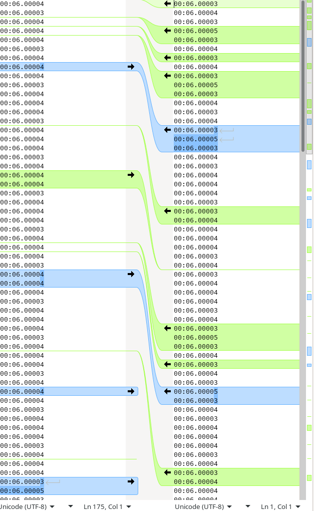
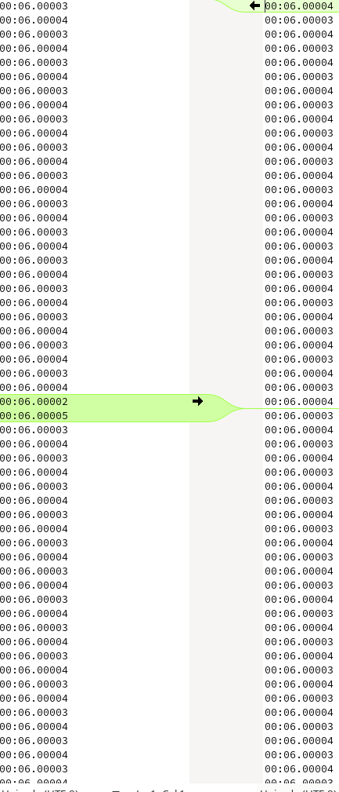

# Product
* [ ] Make 10
* [ ] Put on sale

# Accuracy
* [ ] Make sure fw is compiled with -O3 (trigger algorithm)
* [x] Make unit-tests possible. GPIO external trigger.
  * [x] Make USB output with 1ms resolution - for trigger testing.
* [x] Use TXCO obviously. Pick one and change the footprint.
  * [x] Choose one
  * [x] Test it somehow (it's tiny, and I don't have a footprint on PCB)
* [x] There has to be a bug in the trigger algorithm. When the resolution was set to 10ms there have been off by 10ms errors on 4s runs (1 in 20 aprox). But when the resolution was set to 100µs, the error fluctuates between 300 and 600µs (-O0). When -O3 and 100µs resolution, the error is smaller like 200-400µs but it also fluctuates. 10ms = 10000µs. Divided by 20 gives 500µs, so it is almost like in the first scenario the errors accumulated somehow. 

* [x] Timer TIM1 should be restarted (counting from 0) when the start event happens. EDIT: no. 2 participants implementation would have to use 2 timers then. 
  * [x] test
* [x] Value of the counter should be taken into account when system stops. It's value should be rounded, not discarded like now.
  * [x] test
* [x] Trigger tests
* [x] Improve IR trigger
  * [x] Test new receivers (for IR curtains, barriers)
* [x] CAN latency tests.
* [ ] GPSDO tests
* [x] loop / stop mode should be active according to local configuration, not the event type. This is because micro receiver does not have button to change the mode! The mode can be changed only on the regular. 
* [x] Test if everything works when switching modes from stop to loop back and forth without powering off. Will it transition between modes seamlesly?
* [x] Timer overflow problem! EDIT [it's ok](https://stackoverflow.com/questions/7221409/is-unsigned-integer-subtraction-defined-behavior)
  * [x] I reintroduced the problem rising the Result accuracy to 64 bits. 
* [ ] There is wrong naming of absolute time (from the device start) and time durations (diff between two time points). Use std::chrono naming.
* [ ] lvds pulses (on the output of the transceiver) are 10ms longer. Is 22ms, should be 12. Maybe it's nothing, but curious why.
* [x] I have LVDS, I can lower the CAN bus bitrate
  * [x] I can lower the CAN bus IRQ priority. It still has 1, and a comment that it is low, when in fact it isn't. Dunno why. Lowered to 3.
* [ ] ~~Do not disable IRQs in InfraRedExti~~ EDIT : critical section is necessary.
* [x] After resetting the main (regulrar) stopwatch, connected micro can send a stop or loop signal which instantenously shows a result on the screen, even though there were no counting on the screen. This first result should be ignored. EDIT it is, because FastStateMachine is in ready state, and then it ransitions to the Loop state.
* [x] Legacy mode for Piotr.
* [x] 22:09,495 shows as 22 09 49 on the screen. Piotr. Possible that he failed to upgrade to the newest. EDIT : cannot reproduce.
* [x] Check if "blind-time" setting which is set on the regular receiver is honored on the connected micro. I think it is not.
  * [x] Generally speaking setBlind does not seem to work. He sets, and then reads, and gets the old value.
  * [x] getFlip, setFlip - does not store values. Does the config work at all?
  * [ ] All the commands should be tested when 2 or more receivers are connected.
* [x] factory reset does not work
* [x] Screen is flickering a little when there is nothing connected to the CAN. This is because the external trigger have higher priority than the screen, and is picking up the CAN signals via cross talk. Those (very fast) edges fire up the ISR very frequently 
* [x] I can see 50Hz on the LVDS outputs (R pin connected to the MCU). However there are pretty long danggling wires connected to this port. Maybe pull low? Pulling low helped.
* [ ] Does noise detection even work? Why it is not reporting an noise-error when the cable is dangling (spurious pulses can be seen using the analyser).
* [x] Increase Result type from uint32_t to 64. Store 1µs resolution. Improvement is hard to observe, but something changed for sure. See attached images at the bottom of this paragraph. Compared are two lists of results where two devices were configured like in test A3, but with signal gen instead of IR.
* [ ] Test signal integrity. I see spurious pulses when moving stuff around on the desk. And when turing appliances on or off. Desolder test wires!

10µs resolution:


1µs resolution:


# Trigger (noise filtering)
* [ ] ~~Signal strength reduction (/2) switch in the TX. For indoor use.~~ EDIT : adjust resistors and leave the switch as it is. Middle position will be what is current lowest, and the new lowest will be even lower.
* [x] Minimum event length should be configurable (now 10ms)
* [x] Trigger low steady time should be the same as the minimum event length.
* [ ] Command for noise level reporintg.
* [ ] maybe duty cycle condition should depend on noise level?
* 2 types of disturbance in the signal : 
  * Too intense IR + reflections (meaning it is hard to interrupt it) -> chopped during the event, clean otherwise. 
  * Too weak IR -> haven't checked. 
  * Exteral DC light -> both high and low states are littered with noise.
* [x] Polish the trigger class (Detector)
* [x] Check on the oscilloscope - I've seen curious state changes, and I don't know if they're OK.
* [x] Check how fast is the onEdge ISR without the screen running. EDIT : no noticeable change.
* [x] Optimise onEdge
  * [x] Profile on a PC
  * [x] Depending on profiling data change circular buffer implementatiion?
  * [x] std::function in Gpio EXTI ISR - remove!
* [ ] Noise level live display on the main screen - this would aid aiming / setting up the RX/TX pair (but what when 1 or more micro-RX connected?).
* [ ] ~~When cannot keep up with the ISR, turn it off for a period. There's no sense.~~
* [ ] Trigger config to flash
* [ ] Czas w 32 bitach bo i tak mierzymy względne odstępy a nie absolutne. Typ result1us jako klasa z dwiema 32 bitowymi polami lub po prostu do ir bierzemy młodsze 32. EDIT : **kiedyś**.
* [x] Stan nieustalony jako 3 stan PWM. Triger tevt dopuszcza mały kawałek stanu ś nieustalonego pomiędzy wysokim a niskim
* [ ] ~~Slice PWM z 5 elementami załatwi problem z testu LO w PWM im rhe middle.~~ EDIT : czy warto?
* [ ] ~~Można spróbować liczyć PWM tylko co 3/5 lub więcej krawędzi. To spowoduje że isr exti będzie wykonywano skomplikowane obliczenia tylko raz na 3/5 razy. To zmniejszy prawdopodobieństwo mised isr 3/5 krotnie.~~ EDIT : zmnijesza dokładność, bo początek triggera może wypaść pośrodku.
* [x] Można uprościć circular buffer
* [x] Jeden event na raz. Teraz po beamRestored wrzuca jeszcze trigger, bo nie czyści stanu wewnętrznego.
* [ ] Noise liczba spikow na długą i niezależna od ustawień jednostkę czasu np 1s. Ten okres powinien być zależny od charakteru typowych zakłóceń. Dzielimy sygnał na sekundowe odcinki. Histereza. Działa cały czas nawet gdy blind.
  * [ ] Wykrywanie szumu musi być jakoś powiązane z aktualnym duty cycle level. Jeśli nie będzie to możemy mieć sytuację że pokazuje się niski poziom szumu, ale z powodu wysokiego progu duty nie łapiemy trigeroe. No i to będzie wyglądało jak błąd! Załóżmy, że min trigger event jest 200µs (mało, ale załóżmy że tak jest). Wówczas tylko jeden jedyny noise spike o minimalnej długości (100µs) spowoduje, że już nie wiadomo czy to był trigger, czy nie. 
* [ ] No signal dzielimy sygnał na odcinku. Uzależnione od ustawień. Blond timer i min event . A może jednak nie uzależniać od blind timer?  Jak ktoś ustawy blind na 10 sekund to słabo będzie działać. Może jednak 1s tak samo jak z noise, ale w czasie blind time po prostu nie wykrywany ani trigeroe ani blind Jeżeli w odcinku czasu ty hiduty większe niż tteshold (ten sam co przy triger) to zgłaszamy. Żeby odwołać histereza
* [ ] Draw a diagram of all of this.
* [ ] Test minimum event length in unit tests.
  * [ ] Test when minimum event lenght is longer than blind period.
* [ ] Blind time.
* [ ] IR off by default in the settings in the regular receiver.
* [ ] FastStateMachine compatible fully with the new detector.

# Firmware
* [x] Settings memory (screen flip & sound on/off should be persisted)
* [x] USB firmware upgrade
  * [x] Test
  * [ ] Document
* [x] USB CDC. There are huge problems.
* [x] RTC
  * [x] Write time and date to the output
  * [x] Rtc date and time is persisted when power is turned off
  * [x] test with low quiescent LDO.
  * [x] Display 
 * [x] battery level sensing.
   * [x] There's something wrong with the LEDs
 * [x] loop measurements 
 * [x] input in console
 * [x] Time bigger than 16b in history and everywhere else.
   * [x] Measuring.
   * [x] Saving to flash.
   * [x] Sending through CAN bus.
   * [x] USB output.
 * [x] Kiedy nie ma IR, to wyświetlać same kreski, albo -no ir-
 * [x] Optimize spaghetti code in the FastState machine
 * [x] LED multiplexing driven by hardware timer to prevent frying it in case of program hang.
 * [x] When other CAN devices are absent, we should deal with it gracefully. Now I throw hundreds of error messages driving system useless.
 * [x] buzzer volume or if buzzer at all.
 * [x] Screen dims itself to 0 sometimes.
 * [x] Dots indicating the resolution of the time display.
 * [x] CAN_LATENCY_CORRECTION must be assesed again because I've changed how the START is sent (4B additionally).
 * [ ] Run mode (loop/stop) should be independent of CAN bus trigger message. The receiver should always work according to the current mode, not the message type that triggered it. That said, there should only be one start message as it once was. This is because 
 * [ ] Time corrections in unifoirm way:
   * [ ] CAN latency when internal + extarnal sensors are used.
   * [ ] Trigger rising and falling correction
     * [ ] Sending this correction via CAN bus as well
     * [ ] Bigger precission than Result type can provide. I have 2 HW timers, it would be wise to store state of both of them (?). yeah, I could use uint64_t instead of uint32_t as a result type. Then I could store 1µs or even 500ns. This would hopefully decrease errors caused by arithmetic (there are some substractions). Alternatively I could get rid of those substractions, but I think I introduced this during noise-cancelation implementation.
* [ ] Config behavious is undefined after layout change.


# Bugs
* [x] So it happened that it couldn't save results history when the page overflowed from 1 back to 0 (after 128 measurements). Probably it didn't cleared the flash.
* [ ] Sometimes when the `reset` command is issued the display is not cleared (stopwatch stops, but the last result is persisted on the screen).
* [x] Long press in tne "results/counter" mode crashes the firmware. Fix and do the reset then.
* [x] ~~Clear command makes the next trigger event to be skipped / missed.~~ It does not. It stops the CPU for some period of time (few miliseconds) and thus `startTimeout` in the `FastStateMachine` measures more than 5000ms. My signal gen was set to 5010ms and this little difference (of only 10ms) was too small.
* [x] USB - can't output more than 2048B at once. In case of overflow the rest of text is clipped.
* [ ] When history is short (16B per page) results are working somewhat oddly:
* [x] after 10 mins there's something wrong going on with the time display. No leading 1 or something. Reported by Pyxis.
* [x] When the terminator is flipped to OFF and nothing is connected, CAN initialization fails, and the program hangs (in Error_Handler).
* [ ] New bunch of bugs 23/04/2021
  * [ ] Synchronization problem. Ext trigger is generated AFTER valid trigger event, which can be at least `minTriggerEvent` ms long (default 10ms), but there is no upper limit on how long it should be. So ext trigger is delayed unknown amount of time! I somehow forgot about it.
  * [x] System comprised of main RX and 2x micro RX sometimes hangs after some time. I.e. program runs (at least on the main RX), USB is OK, but no trigger is detected. After resetting the main RX (without power cycle which would also reset the two micros) everything gets back to normal, so I suspect the problem lies on the main RX part. EDIT loose cables are the most probable culprit.
  * [ ] Display went crazy (at leas on RelWithDebInfo). Like in Debug, but after some time, and it changes - like timers not synchronized properly. All 3 optimization levels are affected. EDIT : CC @ Release seems to work OK at least after ~1 hour.
  * [ ] fps setting works OK only to ~1000 fps (at least on CA displays. Black CC ones not tested on this commit). Above 1000 fps digits (or only dots?) are oddly shifted.
  * [ ] FLASH memrory write (after finished course) desynchronizes the two DMAs. The higher the fps, the more prominent this bug gets.
* [x] After a few days / (?) month is 1 month off (is 03, should be 04) and days as well (is 25, should be 26). Date displayed on the LED screen is OK, this is USB where it is wrong. EDIT I've added +1 in printDate, and fixed the problem.
* [ ] T3 does not work.
* [ ] T4 without synchronization is more acurate (40-50µs margin instead of ~150µs).
  

# Piotr
* [x] Zapis ustawień
* [x] Czas ślepnięcia jako ustawienie
* [x] iscounting
* [x] current (aktualny wynik - to samo co last, więc może last)
* [ ] Osłonka przeciwsłoneczna
* [x] Zewnętrzny czujnik
* [x] Opcja tyrybu /zawody/trening. Opcje zawody to takie dzialanie jak jest teraz. Trening : Liczy, wyswietla czas przez 10s, w miedzyczasie liczy "drugie okrazenie, i znowu po przecieciu wiazki pokazuje czas przez 10s i jednoczesnie liczy czas do nastepnego.
  * [x] Z zewnętrznym czujnikiem.
  * [x] Loop na dwa czujniki i dwa nadajniki
* [x] Opcja /restart : Wyslanie tej komendy powoduje zatrzymanie liczenia czasu jesli bylo wlaczone, ustawia wyswietlacz na 0:00 i czeka na przeciecie wiazki i pomiar
  * [ ] Błąd - czasem nie czyści.
* [x] Pipczenie - jesli mozesz zobic na start 1 pip a na pomiar w trybie zawodow 3xpip. Pomiar w tyrybie /trening 2x pip
* [x] Wyniki 
  
# USB
* [x] Does not work under Manjaro.
* [x] Gibberish at the beginning, just after styarting a serial terminal for the first time.
  * [x] I was able to sove this using this *ready* flag, but this is a hack. The bottom line is that there are problems when writing to the buffer while USB cable is disconnected. It should work, this is what the buffer is for. Fix this, and remove the *ready* flag.
* [x] Gibberish everytime the cable gets unplugged and then plugged again by the user.
  * [ ] Sometimes (after first plugin) this error appears. There are a few strange characters at the beginning, like not initialized buffer or something. Maybe this has something to do with the echo and the device receives such suprious chars?
* [x] Communication go crazy after some time (floods the console).
* [ ] USB - change `__disable_irq ()` to ~~NVIC-disable USB~~. No, NVIC is nothe way to go. Maybe there is some USB disable register?
* [ ] Few letters missing from time to time (very rarely):

```
Ala ma kota, a kot ma ale
a ma kota, a kot ma ale
Ala ma kota, a kot ma ale
```

Works under windows 7 and an old Ubuntu. Does not work under Manjaro `Linux futureboy 5.4.39-1-MANJARO #1 SMP PREEMPT Wed May 6 10:36:44 UTC 2020 x86_64 GNU/Linux`

Under Manjaro it behaves very unstable. Only 1 byte at a time san be sent to tyhe PC. if I try to sen 2B in a row, I get nothing on the serial console. If the device is connected through a USB hub, and I dosconnect it, I get the following dmesgs:


```
[ 4586.490066] xhci_hcd 0000:00:14.0: WARN Cannot submit Set TR Deq Ptr
[ 4586.490068] xhci_hcd 0000:00:14.0: A Set TR Deq Ptr command is pending.
[ 4586.492081] xhci_hcd 0000:00:14.0: WARN Cannot submit Set TR Deq Ptr
[ 4586.492084] xhci_hcd 0000:00:14.0: A Set TR Deq Ptr command is pending.
[ 4586.494061] xhci_hcd 0000:00:14.0: WARN Cannot submit Set TR Deq Ptr
[ 4586.494064] xhci_hcd 0000:00:14.0: A Set TR Deq Ptr command is pending.
[ 4586.496077] xhci_hcd 0000:00:14.0: WARN Cannot submit Set TR Deq Ptr
[ 4586.496079] xhci_hcd 0000:00:14.0: A Set TR Deq Ptr command is pending.
[ 4586.498067] xhci_hcd 0000:00:14.0: WARN Cannot submit Set TR Deq Ptr
[ 4586.498070] xhci_hcd 0000:00:14.0: A Set TR Deq Ptr command is pending.
[ 4586.498363] usb 2-4.2.2: USB disconnect, device number 12
[ 4586.500122] cdc_acm 2-4.2.2:1.0: failed to set dtr/rts
```

Solved. The problem was due to lack of USBD_CDC_ReceivePacket calls. So it seems that my prebious implementation was deaf do USB requests, and it broke all communications under Manjaro, whereas under Windows and Ubuntu it worked (the device was able to send, and the host received the data).

# Refactoring
* [x] Config object should be globally available. 
* [ ] Eliminate ifdef galore somehow.
* [x] Rename CANbus start event to "trigger" event.
* [ ] ~~FastStateMachine could be split into two. One for IR and one for CANbus handling. Both would control the same StopWatch instance.~~


# Infrastructure
* [x] Clean the code (prepare for new repo that is)
  * [x] Code should be self-contained. Everything needed for building should be included.
* [x] Remove this "big" display project for now.
* [x] Prepare and commit other projects
* [x] Release FW as opensource.
* [ ] Prepare a web page with documentation.

# Hardware
* [x] Boot pin easy accessible (for DFU).
* [x] Crystal oscillator footprint suitable for modern TCXOs, not this THT crap.
* [x] ~~Reduce holes for CAN socket supports (thise 2 plastic one sticking out)~~ The case is holding the socket in place. Too much effort.
* [x] Ldo for RTC should be 3v3 not 1v8. Voltage difference would be smaller.
* [x] Przetestować RTC z tym małym LDO.
* [x] Battery protection in software (for overdischarge)  EDIT : **6.4mA in standby mode (a lot)**!
  * [x] When powered off no software is running. What is the current draw of ldo plus rtc? 0.5µA (includeing RTC + low Q LDO)
  * [x] Measure what all elements except the µC and LEDs are drawing, and whether we should optimize this, or leave alone.
  * [x] When powered on, simply go to sleep, calculate current, maybe modify HW so it draws less quiescent current.
  * [x] Same for the transmitter
* [ ] Battery protection in hardware. While software protection works, a peripheral powered from +BATT can be attached to the CANbus port thus draving a current. I this peripheral doesn't have its protection, then the battery can be over-discharged.
* [x] If the transmitter had an uc, we could use the charging led to indicate that it is running, and there would be no changes to the casing necessary.
* [x] ~~Charging led to uc,~~ charger outputs as well. This way we could sense when charger plugged in.
* [x] Check common cathode configuration
* [x] Check µC - charger connection.
* [ ] Field tests of the trigger 
  * [x] Rough range tests shows that there's no noticeable change.
  * [ ] Problems when exposed to the direct sunlight.
  * [ ] Poprawić działanie we wnętrzach (incadescent lights & cameras) ????
  * [ ] Jeszcze osłabić sygnał IR.
* [x] 56kHz transmitter.
* [x] Test points.
* [x] ~~Fix the distance between the holes on 18650 battery holder. **Not until new arrive**.~~ Besides : the holder is supported by case's back wall.
* [x] Route the receiver PCB
* [x] USB 2.0 port can source only 500mA while, I am charging at 660mA. Maybe I should lower the consumption?
* [x] Route the transmitter (mcu branch)
* [x] Identify what causes spurious trigger release when power line noise is present. Is it the test trigger, or the IR trigger. Observe what happens using an oscilloscope. Turning a solder iron or hotair on/off causes this to happen (It was a long cable connecting the signal generator with the transmitter. It was the transmitter which caused this).
  * [x] Fix. Problem does not occur when the test trigger is disconnected.
  * [x] ~~Consider disabling the test trigger in production IF this is caused by it.~~ Not neccessary.
* [x] Schotky diode from +BATT to one of the 6P6C socket pins. This would be for powering some smaller peripherals. Why haven't I thought about this earlier!
* Certification / reliability / safety
  * [ ] Input protection
  * [ ] Battery over-discharge preotection
  * [ ] Other means of battery protection (over-charge, over-current)
  * [x] Emi - I can see lots of noise in the CAN bus, and test-trigger can be easily fired by transients.
  * [x] The same goes to IR signal - I can see 20MHz / 60kHz - maybe screen is te cullprit. EDIT - with screen truned off I can see the same noise. **It was caused by faulty power supply of my LED lamps**
  * [x] Connect test trigger to the IR output pin, and make a solder jumper. 


## Huge display
* [ ] czy nie potrzeba kondensatorów !? 
* [ ] jaki jest na prawdę prąd
* [ ] zmierzyć jaki ma być opornik dla DP

# Case
* [ ] Make sure the battery holder is well supported by case's back wall. It has to be fixed in place. This way we can ignore the screws that would normally fix the holder to the PCB.
* [x] Pod grilem musi być wytłoczenie, bo głośniczek jest za wysoki.
* [ ] Fotorezystor musi mieć lepszy dostęp do światła.
* [x] Układ ekranów się zmienił
* [x] Tunel na IR jak w micro
* [x] Wycięcie na power wyższe o 2mm bo chińskie się nie mieszczą
* [x] Oznaczenie terminatora i power. 
* [x] Ten znak power jest brzydki
* [x] Terminator

## Micro
* [x] Otwór na terminator
* [x] Oznaczenie gdzie się włącza terminator
* [x] Ścianka oddzielająca czujnik od reszty
* [x] Kondensatory przeszkadzają, wycięcie lub coś.

# UI 
* [ ] On screen menu
  * [ ] ~~Brightness (1/2/3/auto). Auto as default.~~
  * [ ] 1 or 2 participants
  * [x] Loop mode / normal
  * [x] Date / time setting
  * [x] Time display
* [ ] USB menu should include all what on-display provides plus:
  * [x] Results (via command)
  * [x] Results as they go.

# Possible features 
* [x] µC in the transmitter
  * [x] Battery sensing in the transmitter
* [x] ~~Hardware battery protection in both devices~~ I went with software one.
* [x] Test trigger in the transmitter (same as receiver) - a test point(s)
* [ ] Speed trap. Receivers connected together would measure the speed.
* [x] Result resolution setting (100µs)
* [ ] Chronograph https://en.wikipedia.org/wiki/Gun_chronograph
* [ ] Laser transmitter / receiver. Complex (sub µs) pattern would act as a noise correction. It would at least prevent DC light problems. It would not prevent erros coming from reflections and weak signal. But I still don't know (I'm not sure) about the rest of noise and it's nature. How fast would it be? I think that if we want to achieve 1µs resolution, then we should cope with 1µs spikes. 1µs is too fast to do it in ISR.
* [ ] Test rig with a stepper motor and a wheel with a notch for IR testing.
* [ ] Reflective receiver? For small objects like rc cars? What use cases? Indoors?
* [ ] Proper application.
* [ ] Filming in slow motion (adjustable fps).
* [ ] Receiver that can be connected to an Arduino or RasPI instead of the "regular" receiver. If I ever consider doing this, take the path of minimal effor, and change only the connector and protocol (TTL instead of CAN).

# Requestes
* Better visibility in the sun (black displays). 2x
* 